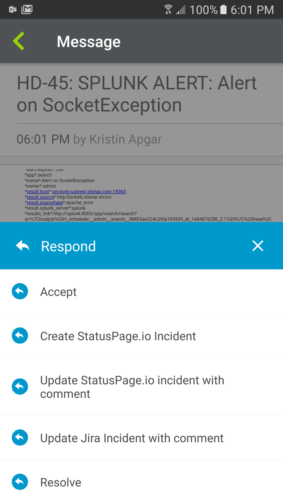
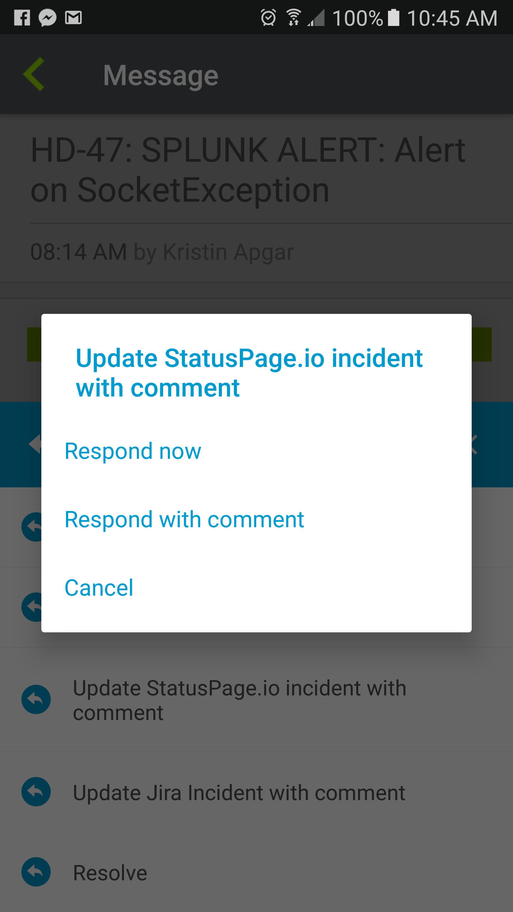
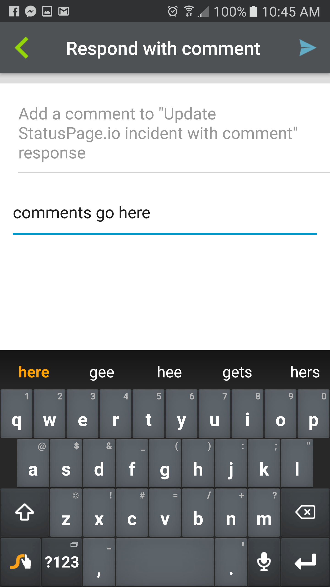

# StatusPage Outbound Integration
With this Outbound Integration, notification recipients can quickly create, update, and resolve StatusPage incidents, right from the xMatters notification! 

This document details how to install and use this integration. 

**NOTE**: As with all integrations in the xMatters Labs, this integration is stll in development, and as such we can provide only limited support. If you run into any problems, open an issue here on Github and we'll see what we can do.

# Pre-Requisites
* [StatusPage.io](https://www.statuspage.io/) account
* Existing communication plan - Use a packaged integration from the [integrations](https://www.xmatters.com/integrations) page, or [build your own](https://support.xmatters.com/hc/en-us/articles/202396229) 
* xMatters account - If you don't have one, [get one](https://www.xmatters.com)! 

# Files
* [StatusPage.js](StatusPage.js) - This is the code for the Shared Library that abstracts the interactions with StatusPage to a higher level. 
* [OutboundResponseScript.js](OutboundResponseScript.js) - This is the Outbound Response script that accepts the response from the notification recipient, inspects the response option selected, and, if necessary, makes the function calls to the StatusPage shared library to make the updates. 

# Installation
## Get StatusPage Token
1. Log in to your StatusPage.io account as an admin user.
2. Click the username in the top right corner, and then select `Manage Account`.
3. On the API tab, copy the Page ID and API Key values

## Add Outbound Integration
1. Log in to your xMatters instance as a user with the Developer role (or anyone with access to the target communication plan). On the Developer tab, click Edit > Integration Builder for the target communication plan. 
2. Click 'Edit Endpoints', and then click `Add Endpoint` to add an endpoint for StatusPage; fill out the following details:

   | Item | Selection |
   | ---- | --------- |
   | Name | StatusPage |
   | Base URL | https://api.statuspage.io/v1/pages/PAGE_ID_HERE |
   Where `PAGE_ID_HERE` should be replaced with the Page ID from StatusPage in the steps above. 
3. Click Save and Close.
4. Click the `Edit Constants` button and `Add Constant`; fill out the following details to create a constant to hold the API key:

   | Item | Selection |
   | ---- | --------- |
   | Name | Status Page Token |
   | Value | API_KEY_VALUE |
   Where API_KEY_VALUE is the API Key from StatusPage in the steps above. 
5. Click `Save Changes` and `Close`.
6. Expand the Shared libraries section (if necessary) and click the `+ Add` button
7. Update the name at the top from `My Shared Library` to `StatusPage`, then paste in the contents of the [StatusPage.js](StatusPage.js) file and hit `Save`.
8. Expand the Outbound Integrations section (if necessary) and click the `+ Add` button. (We are going to add a new script here, but don't worry: this will not impact any existing scripts. You can have several outbound integrations that all run on notification response, as long as you add logic to each one to determine if they should fire.) 
9. Fill out the following details in the wizard:

   | Item | Selection |
   | ---- | ---- |
   | Choose an action | Run a Script |
   | Select a form    | \<Choose the appropriate form> |
   | Select a trigger | Notification responses |
   | Integration name | \<Form name> - Outbound Response - StatusPage.io   **Note** The Integration name format is arbitrary, but including the form name and `StatusPage.io` helps fellow developers see what a script does. |
6. Click Save and Open Script Editor 
7. In the script editor, paste the contents of the [OutboundResponseScript.js](OutboundResponseScript.js) file. 
8. Click Save, and then close the script editor. 
9. On the Forms tab of the communication plan, click Edit > Responses for the relevant form that will handle the StatusPage response options. 
10. Add the following response options with the related attributes. You can change the text displayed, but the code in the [OutboundResponseScript.js](OutboundResponseScript.js) file will reference the value in the `Response` column. If you do change the text, make sure to update the OutboundResponseScript to reflect the value in the Response column. Also note that comments (annotations) are only supported on mobile devices. 

   | Response | Email Description | Voice Prompt | Options  |
   | -------- | ----------------- | ------------ | -------- |
   | Create StatusPage.io Incident               | Create StatusPage.io Incident               | Create StatusPage.io Incident  | Record Response |
   | Update StatusPage.io Incident with Comment  | Update StatusPage.io Incident with Comment  | Update StatusPage.io Incident with Comment | Record Response |
   | Resolve StatusPage.io Incident              | Resolve StatusPage.io Incident | Resolve StatusPage.io Incident | Record Response |

# Testing

Testing the changes will differ based on your specific communication plan, but new events will have three new response options. For example:

**Display the response options**

**Choose to include comments**

**Enter comments**

First, select the `Create StatusPage.io Incident` option to generate the incident. Then use the `Update StatusPage.io Incident with Comment` option to add a comment to the StatusPage incident. 
